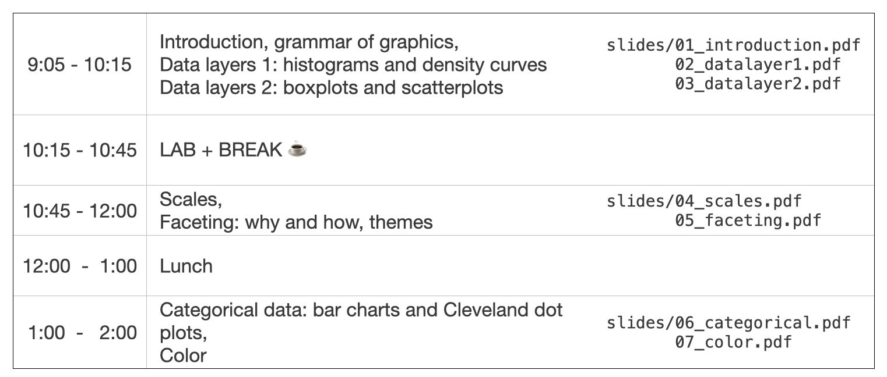

# Workshop materials for Effective Graphs with ggplot2

*Instructor: Joyce Robbins, Columbia University*

Kansas City, September 19, 2025

# Schedule

Workshop schedule (revised)

# Resources

[ggformat](https://www.github.com/jtr13/ggformat)

[ggplot2 cheatsheet](https://rstudio.github.io/cheatsheets/data-visualization.pdf)

(or click "Help", "Cheat Sheets", "Data Visualization with ggplot2" in RStudio to download)

[Required aesthetic mappings](https://edav.info/learning_ggplot2.html#required-aesthetic-mappings)

[Colors in R](http://www.stat.columbia.edu/~tzheng/files/Rcolor.pdf)

